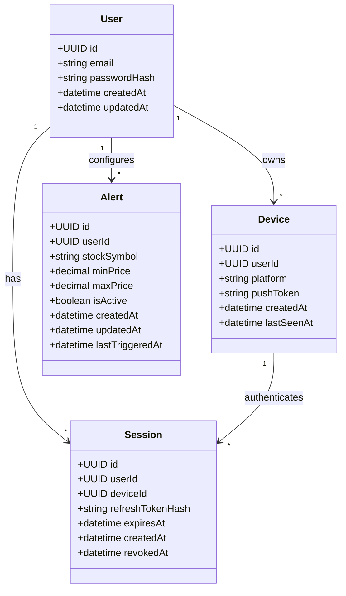

# stocked

Mobile app for monitoring stocks using [Finnhub](https://finnhub.io/) Stock APIs.

## Domain model

**Auth:** `User` → `Device` → `Session`. `Session.userId` is denormalized from `Device.userId` at creation so revocation does not require a join.

**Alerts:** Scoped to the user (account-wide). A background job polls Finnhub, matches active `Alert` rows, then sends push notifications to all of the user's `Device` rows with a valid `pushToken`.

| Original field | Model field | Notes |
| --- | --- | --- |
| `password` | `passwordHash` | Never store plaintext |
| `token` | *(not in DB)* | Short-lived JWT access tokens, validated statelessly |
| `refresh_token` | `refreshTokenHash` | Store hash only; rotate on use |
| `device_id` | `deviceId` | FK to `Device` |
| — | `userId` on `Session` | Denormalized from `Device` for fast revocation |

## Design notes

Decisions and caveats to settle before implementing the schema.

### Security

- Store `passwordHash` (bcrypt/argon2), never plaintext `password`.
- Do not persist access tokens in `Session`; use short-lived JWTs. Persist only hashed refresh tokens; use `tokenVersion` on `User` or a denylist if early access-token revocation is required.
- Add `expiresAt` and `revokedAt` on `Session` for logout and remote wipe.
- Enforce a unique index on `User.email`; add email verification before production.

### Modeling

- Use UUID primary keys on all entities.
- Add timestamps (`createdAt`, `updatedAt`, `lastSeenAt` on `Device`).
- Denormalize `Session.userId` from `Device` at insert; index `(userId, revokedAt)` for revoke-all flows without joining `Device`.
- On `Device`, include `platform` and nullable `pushToken` for push delivery; prefer server-issued device IDs.
- On `User` delete, cascade or soft-delete `Device`, `Session`, and `Alert`.

### Alerts

- Define trigger rules for `minPrice` / `maxPrice` (band enter/exit, above-only, below-only; reject both null unless intentional).
- Validate `minPrice <= maxPrice` when both are set; normalize `stockSymbol` to uppercase.
- Use `lastTriggeredAt` plus a cooldown to avoid notification spam on volatile symbols.
- `Watchlist` is out of scope for MVP; alerts imply interest for now.

### Operations

- Clarify one active session per device (upsert on login) vs session history.
- Finnhub quotes stay external; a worker polls prices and matches `Alert` rows. A `PriceSnapshot` cache table is optional later.
