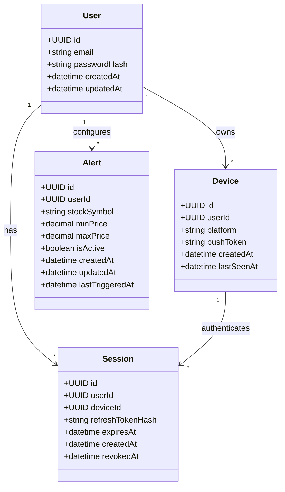

# stocked

Mobile app for monitoring US stocks. Market data is fetched through the [stocked-gateway](stocked-be/apps/stocked-gateway/) API, which uses **two providers** on purpose (see [Market data providers](#market-data-providers) below).

## Domain model

**Auth:** `User` → `Device` → `Session`. `Session.userId` is denormalized from `Device.userId` at creation so revocation does not require a join.

**Alerts:** Scoped to the user (account-wide). The `@stocked/alerts-worker` service subscribes to Finnhub WebSocket trades for symbols with active alerts, detects price **crossings** against `minPrice` / `maxPrice`, then sends FCM push to all of the user's `Device` rows with a valid `pushToken`. The gateway notifies the worker when alerts are created or deactivated.

| Original field | Model field | Notes |
| --- | --- | --- |
| `password` | `passwordHash` | Never store plaintext |
| `token` | *(not in DB)* | Short-lived JWT access tokens, validated statelessly |
| `refresh_token` | `refreshTokenHash` | Store hash only; rotate on use |
| `device_id` | `deviceId` | FK to `Device` |
| — | `userId` on `Session` | Denormalized from `Device` for fast revocation |

## Design notes

Decisions and caveats to settle before implementing the schema.

### Security

- Store `passwordHash` (bcrypt/argon2), never plaintext `password`.
- Do not persist access tokens in `Session`; use short-lived JWTs. Persist only hashed refresh tokens; use `tokenVersion` on `User` or a denylist if early access-token revocation is required.
- Add `expiresAt` and `revokedAt` on `Session` for logout and remote wipe.
- Enforce a unique index on `User.email`; add email verification before production.

### Modeling

- Use UUID primary keys on all entities.
- Add timestamps (`createdAt`, `updatedAt`, `lastSeenAt` on `Device`).
- Denormalize `Session.userId` from `Device` at insert; index `(userId, revokedAt)` for revoke-all flows without joining `Device`.
- On `Device`, include `platform` and nullable `pushToken` for push delivery; prefer server-issued device IDs.
- On `User` delete, cascade or soft-delete `Device`, `Session`, and `Alert`.

### Alerts

- Define trigger rules for `minPrice` / `maxPrice` (band enter/exit, above-only, below-only; reject both null unless intentional).
- Validate `minPrice <= maxPrice` when both are set; normalize `stockSymbol` to uppercase.
- Use `lastTriggeredAt` plus a cooldown to avoid notification spam on volatile symbols.
- `Watchlist` is out of scope for MVP; alerts imply interest for now.

### Operations

- Clarify one active session per device (upsert on login) vs session history.
- Finnhub WebSocket trades drive alert matching in `stocked-alerts-worker` (single long-lived connection). A `PriceSnapshot` cache table is optional later.

## Market data providers

Stocked does not use a single vendor for everything. The gateway splits responsibilities by what each provider offers on a **free** tier:

| Concern | Provider | Why |
| --- | --- | --- |
| Symbol search, US ticker list, stock metadata | [Finnhub](https://finnhub.io/) | Already integrated; free tier includes `/search`, `/stock/symbol`, and `/quote` for US symbols. |
| Price alerts (real-time) | Finnhub | WebSocket trades in `stocked-alerts-worker`; gateway `/quote` for UI snapshots. |
| Historical chart OHLCV (line charts) | [Financial Modeling Prep (FMP)](https://site.financialmodelingprep.com/) | Finnhub’s `/stock/candle` endpoint is **not** on the free plan ([official note](https://github.com/finnhubio/Finnhub-API/issues/546)); FMP’s free Basic tier includes daily end-of-day history via `historical-price-eod/full`. |

The mobile app only talks to the gateway. API keys for Finnhub and FMP live in `stocked-be/apps/stocked-gateway/.env`, never in the client.

Chart responses are cached on the server (1 hour per symbol/range) to stay within FMP’s free quota (250 requests/day). For a published consumer app, review each vendor’s display/redistribution terms (especially FMP).
